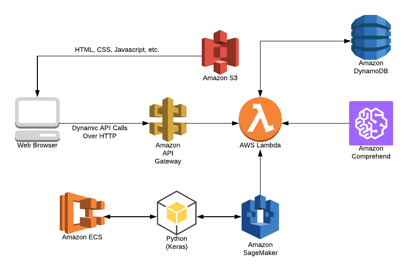

# Unicorn NLP Workshop

In this workshop you'll deploy a simple web application that enables users to submit product feedback . The application will present users with an HTML based user interface where they can submit feedback, predict sentiment about submitted feedbacks and identify gender for the user submitting feedback.

The application architecture uses [AWS Lambda](https://aws.amazon.com/lambda/), [Amazon API Gateway](https://aws.amazon.com/api-gateway/), [Amazon S3](https://aws.amazon.com/s3/), [Amazon DynamoDB](https://aws.amazon.com/dynamodb/), [Amazon Comprehend](https://aws.amazon.com/comprehend/), [Amazon ECR](https://aws.amazon.com/ecr/), and [Amazon SageMaker](https://aws.amazon.com/sagemaker/). S3 hosts static web resources including HTML, CSS, JavaScript, and image files which are loaded in the user's browser. JavaScript executed in the browser sends and receives data from a public backend API built using Lambda and API Gateway. DynamoDB provides a  persistence layer where data can be stored by the API's Lambda function. Comprehend provides NAtural Language Processing service needed to predict the sentiment from the feedback entered by users. SageMaker is used to orchestrate the machine learning process needed to predict gender of the user from name. ECR is used to host the machine learning training code. Finally, Python binding for Keras - machine learning framework is used to create the model needed for gender prediction.

See the diagram below for a depiction of the complete architecture.

