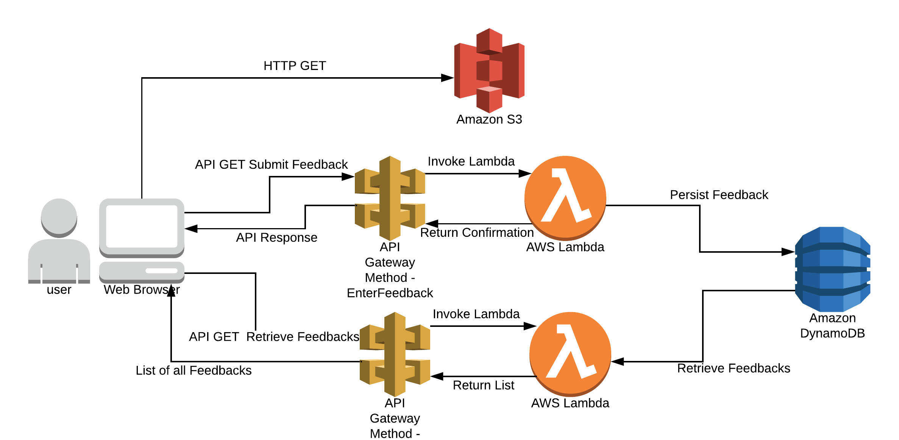
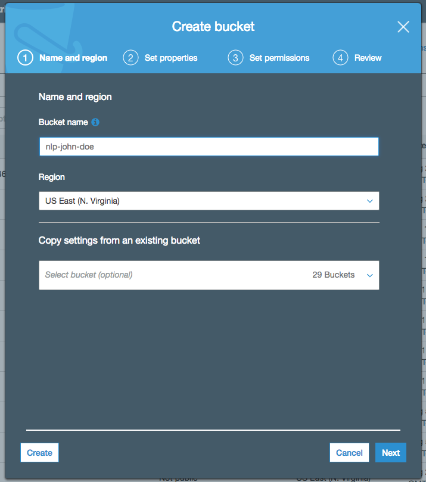

# Unicorn NLP Workshop

In this workshop you'll deploy a simple web application that enables users to submit product feedback . The application will present users with an HTML based user interface where they can submit feedback, predict sentiment about submitted feedbacks and identify gender for the user submitting feedback.

The application architecture uses [AWS Lambda](https://aws.amazon.com/lambda/), [Amazon API Gateway](https://aws.amazon.com/api-gateway/), [Amazon S3](https://aws.amazon.com/s3/), [Amazon DynamoDB](https://aws.amazon.com/dynamodb/), [Amazon Comprehend](https://aws.amazon.com/comprehend/), [Amazon ECR](https://aws.amazon.com/ecr/), and [Amazon SageMaker](https://aws.amazon.com/sagemaker/). S3 hosts static web resources including HTML, CSS, JavaScript, and image files which are loaded in the user's browser. JavaScript executed in the browser sends and receives data from a public backend API built using Lambda and API Gateway. DynamoDB provides a  persistence layer where data can be stored by the API's Lambda function. Comprehend provides NAtural Language Processing service needed to predict the sentiment from the feedback entered by users. SageMaker is used to orchestrate the machine learning process needed to predict gender of the user from name. ECR is used to host the machine learning training code. Finally, Python binding for Keras - machine learning framework is used to create the model needed for gender prediction.

See the diagram below for a depiction of the complete architecture.

# Module 1: VOC Web Application Framework with Amazon S3

In this module you'll configure Amazon Simple Storage Service (S3) to host the static resources for your web application. In addition you'll also create the serverless framework needed to persist data from the eront-end. These include a DynamoDB table to store customers' feedbacks, an API Gateway deployment with methods to store and retrieve data, and associated Lambda functions to facilitate the integration with serverless backend.

In subsequent modules you'll add AI/ML functionalities to this application, using Amazon Comprehend to analyze users' sentiments, and a hosted endpoint on SageMaker to identify users' gender.

If you're already comfortable hosting webapplication on Amazon S3 and using APi Gateway and Lambda to add data persistence and retrieval capabilities to an web-application via Javascript, or you just want to skip ahead to satrt working with Amazon Comprehend and AWS SageMaker, you can launch one of these AWS CloudFormation templates in the Region of your choice to build the necessary resources automatically.

Region| Launch
------|-----
US East (N. Virginia) | 
US East (Ohio) | 
US West (Oregon) | 
EU (Ireland) | 

<strong>CloudFormation Launch Instructions (expand for details)</strong>

1. Click the **Launch Stack** link above for the region of your choice.

1. Click **Next** on the Select Template page.

1. Provide a globally unique name for the **Website Bucket Name** such as `nlp-yourname` and click **Next**.
    

1. On the Options page, leave all the defaults and click **Next**.

1. On the Review page, check the box to acknowledge that CloudFormation will create IAM resources and click **Create**.
    

    This template uses a custom resource to copy the static website assets from a central S3 bucket into your own dedicated bucket. In order for the custom resource to write to the new bucket in your account, it must create an IAM role it can assume with those permissions.

1. Wait for the `nlp-workshop-voc-webapp` stack to reach a status of `CREATE_COMPLETE`.

1. With the `nlp-workshop-voc-webapp` stack selected, click on the **Outputs** tab and click on the WebsiteURL link.

1. Verify the VOC application home page is loading properly and move on to the next module, [Sentiment Analysis](../2_SentimentAnalysis).

## Architecture Overview

The architecture for this module is very straightforward. All of your static web content including HTML, CSS, JavaScript, images and other files will be stored in Amazon S3. Your end users will then access your site using the public website URL exposed by Amazon S3. You don't need to run any web servers or use other services in order to make your site available.

For the purposes of this module you'll use the Amazon S3 website endpoint URL that we supply. It takes the form `http://{your-bucket-name}.s3-website-{region}.amazonaws.com`. For most real applications you'll want to use a custom domain to host your site. If you're interested in using a your own domain, follow the instructions for [setting up a static website using a custom domain](http://docs.aws.amazon.com/AmazonS3/latest/dev/website-hosting-custom-domain-walkthrough.html) in the Amazon S3 documentation.

In addition, you'll create a DynamoDB table to persist the data that the customers submit using the web-form from the application. This table will be be accessed via two Lambda Functions that you'll implement. Lambda functions are on-demand compute platforms, where you specify the piece of code containing the business logic, and AWS runs it on-demand without you having to create and manage your compute instances.

Finally, you'll use API Gateway to expose the Lambda functions. This API will be publicly accessible from the internet. You'll invoke the methods on this gateway to send and request data from the web-application. It is this integration that turns your statically hosted website into a dynamic web application.

## Implementation Instructions

Each of the following sections provide an implementation overview and detailed, step-by-step instructions. The overview should provide enough context for you to complete the implementation if you're already familiar with the AWS Management Console or you want to explore the services yourself without following a walkthrough.

If you're using the latest version of the Chrome, Firefox, or Safari web browsers the step-by-step instructions won't be visible until you expand the section.

### Region Selection

This workshop can be deployed in any AWS region that supports the following services:

- AWS Lambda
- Amazon API Gateway
- Amazon S3
- Amazon DynamoDB
- Amazon SageMaker

You can refer to the [region table](https://aws.amazon.com/about-aws/global-infrastructure/regional-product-services/) in the AWS documentation to see which regions have the supported services. Among the supported regions you can choose are N. Virginia, Ohio, Oregon, and Ireland.

Once you've chosen a region, you should deploy all of the resources for this workshop there. Make sure you select your region from the dropdown in the upper right corner of the AWS Console before getting started.

### 1. Create an S3 Bucket

Amazon S3 can be used to host static websites without having to configure or manage any web servers. In this step you'll create a new S3 bucket that will be used to host all of the static assets (e.g. HTML, CSS, JavaScript, and image files) for your web application.

#### High-Level Instructions

Use the console or AWS CLI to create an Amazon S3 bucket. Keep in mind that your bucket's name must be globally unique across all regions and customers. We recommend using a name like `nlp-firstname-lastname`. If you get an error that your bucket name already exists, try adding additional numbers or characters until you find an unused name.

<strong>Step-by-step instructions (expand for details)</strong>

1. In the AWS Management Console choose **Services** then select **S3** under Storage.

1. Choose **+Create Bucket**

1. Provide a globally unique name for your bucket such as `nlp-firstname-lastname`.

1. Select the Region you've chosen to use for this workshop from the dropdown.

1. Choose **Create** in the lower left of the dialog without selecting a bucket to copy settings from.

    

