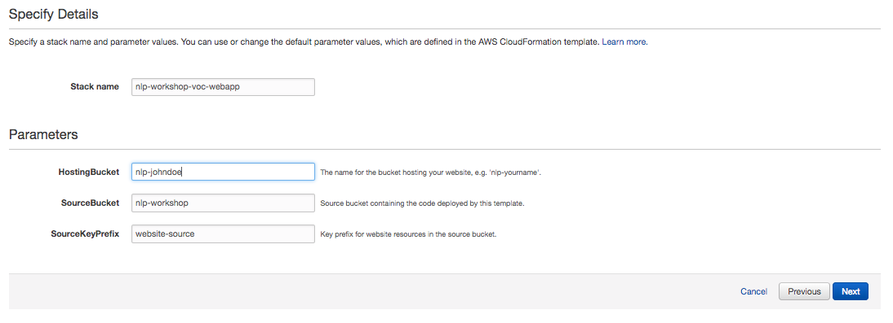
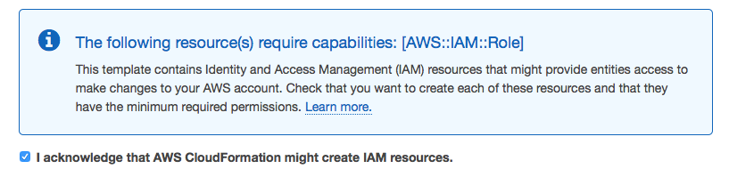

# Unicorn NLP Workshop

In this workshop you'll deploy a simple web application that enables users to submit product feedback . The application will present users with an HTML based user interface where they can submit feedback, predict sentiment about submitted feedbacks and identify gender for the user submitting feedback.

The application architecture uses [AWS Lambda](https://aws.amazon.com/lambda/), [Amazon API Gateway](https://aws.amazon.com/api-gateway/), [Amazon S3](https://aws.amazon.com/s3/), [Amazon DynamoDB](https://aws.amazon.com/dynamodb/), [Amazon Comprehend](https://aws.amazon.com/comprehend/), [Amazon ECR](https://aws.amazon.com/ecr/), and [Amazon SageMaker](https://aws.amazon.com/sagemaker/). S3 hosts static web resources including HTML, CSS, JavaScript, and image files which are loaded in the user's browser. JavaScript executed in the browser sends and receives data from a public backend API built using Lambda and API Gateway. DynamoDB provides a  persistence layer where data can be stored by the API's Lambda function. Comprehend provides NAtural Language Processing service needed to predict the sentiment from the feedback entered by users. SageMaker is used to orchestrate the machine learning process needed to predict gender of the user from name. ECR is used to host the machine learning training code. Finally, Python binding for Keras - machine learning framework is used to create the model needed for gender prediction.

See the diagram below for a depiction of the complete architecture.

# Module 1: VOC Web Application Framework with Amazon S3

In this module you'll configure Amazon Simple Storage Service (S3) to host the static resources for your web application. In addition you'll also create the serverless framework needed to persist data from the eront-end. These include a DynamoDB table to store customers' feedbacks, an API Gateway deployment with methods to store and retrieve data, and associated Lambda functions to facilitate the integration with serverless backend.

In subsequent modules you'll add AI/ML functionalities to this application, using Amazon Comprehend to analyze users' sentiments, and a hosted endpoint on SageMaker to identify users' gender.

If you're already comfortable hosting webapplication on Amazon S3 and using APi Gateway and Lambda to add data persistence and retrieval capabilities to an web-application via Javascript, or you just want to skip ahead to satrt working with Amazon Comprehend and AWS SageMaker, you can launch one of these AWS CloudFormation templates in the Region of your choice to build the necessary resources automatically.

Region| Launch
------|-----
US East (N. Virginia) | 
US East (Ohio) | 
US West (Oregon) | 
EU (Frankfurt) | 
EU (Ireland) | 
EU (London) | 
Asia Pacific (Tokyo) | 
Asia Pacific (Seoul) | 
Asia Pacific (Sydney) | 
Asia Pacific (Mumbai) | 

<strong>CloudFormation Launch Instructions (expand for details)</strong>

1. Click the **Launch Stack** link above for the region of your choice.

1. Click **Next** on the Select Template page.

1. Provide a globally unique name for the **Website Bucket Name** such as `nlp-yourname` and click **Next**.
    

1. On the Options page, leave all the defaults and click **Next**.

1. On the Review page, check the box to acknowledge that CloudFormation will create IAM resources and click **Create**.
    

    This template uses a custom resource to copy the static website assets from a central S3 bucket into your own dedicated bucket. In order for the custom resource to write to the new bucket in your account, it must create an IAM role it can assume with those permissions.

1. Wait for the `nlp-workshop-voc-webapp` stack to reach a status of `CREATE_COMPLETE`.

1. With the `nlp-workshop-voc-webapp` stack selected, click on the **Outputs** tab and click on the WebsiteURL link.

1. Verify the VOC application home page is loading properly and move on to the next module, [Sentiment Analysis](../2_SentimentAnalysis).

