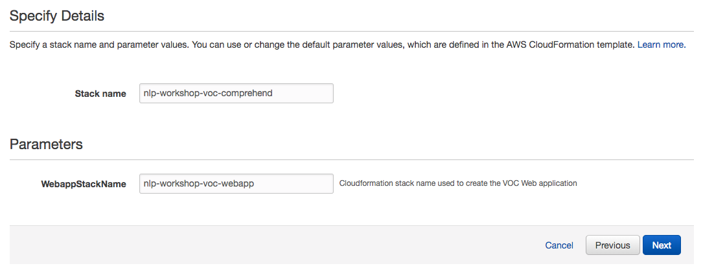
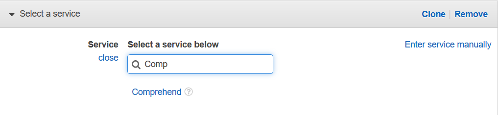
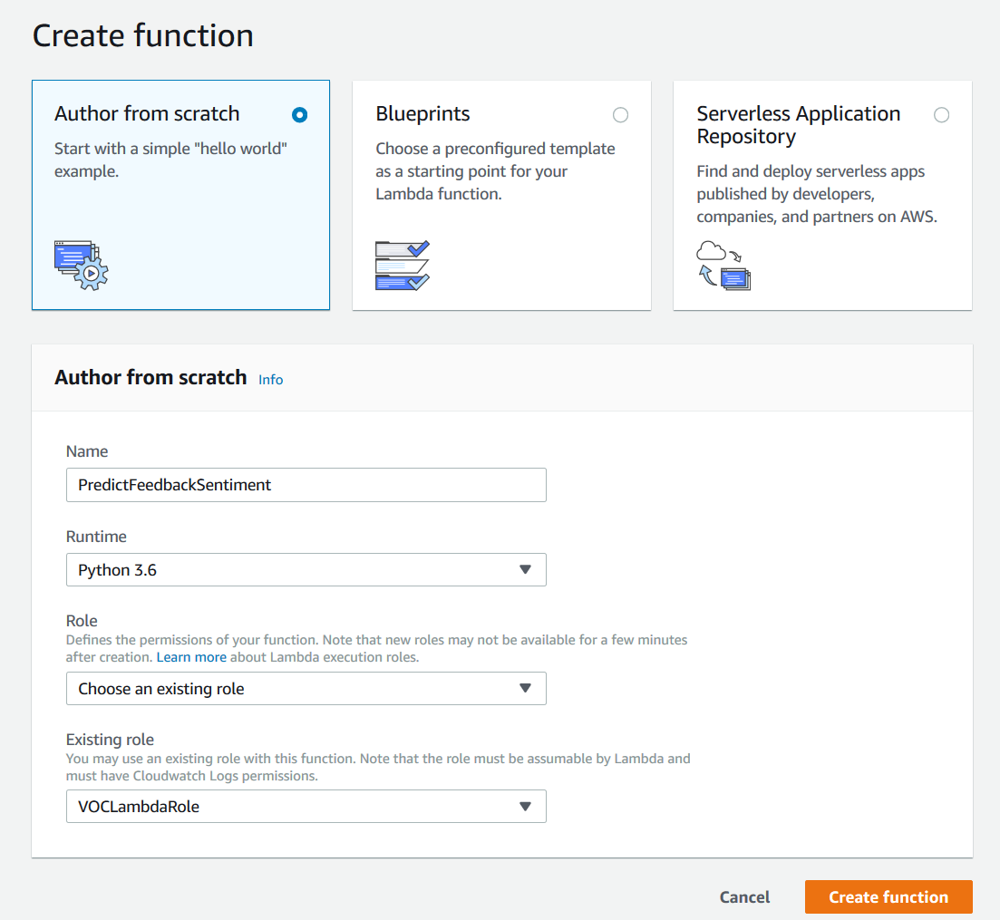
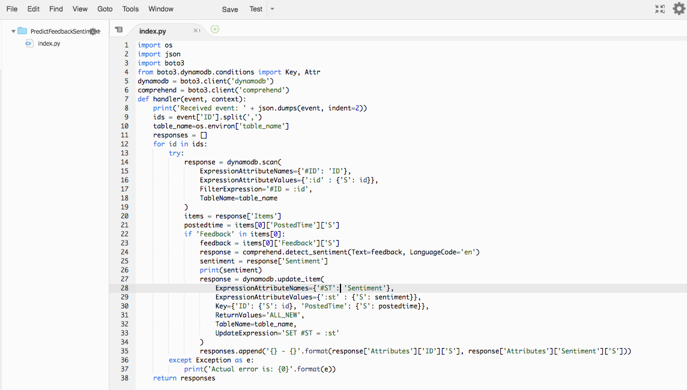

# Module 2: Sentiment Analysis using Comprehend

In this module you'll use [Amazon API Gateway](https://aws.amazon.com/api-gateway/), [AWS Lambda](https://aws.amazon.com/lambda/) and [Amazon Comprehend](https://aws.amazon.com/comprehend/) to analyze the feedback that users enter through the web page. The browser application that you deployed in the first module allows users to enter their name and feedback. The JavaScript running in the browser invokes an API Gateway method, which executes a Lambda function to persist the information entered in a DynamoDB table.
 
In order to activate “Predict Sentiment” functionality, you will add another method in your API Gateway and a corresponding Lambda function. The Lambda function will invoke Amazon Comprehend Service API to predict the sentiment expressed in user's feedback.

If you're already comfortable with invoking SageMaker API from a Lambda function, or just want to skip ahead and start working with custom model training and hosting on SageMaker, you can launch one fo these AWS CloudFormation templates in the region of your choice to build out the sentiment prediction functionality automatically.

Region| Launch
------|-----
US East (N. Virginia) | [](https://console.aws.amazon.com/cloudformation/home?region=us-east-1#/stacks/new?stackName=nlp-workshop-voc-comprehend&templateURL=https://s3.amazonaws.com/nlp-workshop/templates/voc-comprehend.json)
US East (Ohio) | [](https://console.aws.amazon.com/cloudformation/home?region=us-east-2#/stacks/new?stackName=nlp-workshop-voc-comprehend&templateURL=https://s3.amazonaws.com/nlp-workshop/templates/voc-comprehend.json)
US West (Oregon) | [](https://console.aws.amazon.com/cloudformation/home?region=us-west-2#/stacks/new?stackName=nlp-workshop-voc-comprehend&templateURL=https://s3.amazonaws.com/nlp-workshop/templates/voc-comprehend.json)
EU (Ireland) | [](https://console.aws.amazon.com/cloudformation/home?region=eu-west-1#/stacks/new?stackName=nlp-workshop-voc-comprehend&templateURL=https://s3.amazonaws.com/nlp-workshop/templates/voc-comprehend.json)

<details>
<summary><strong>CloudFormation Launch Instructions (expand for details)</strong></summary><p>

1. Click the **Launch Stack** link above for the region of your choice.

1. Click **Next** on the Select Template page.
    

1. On the Options page, leave all the defaults and click **Next**.

1. On the Review page, click **Create**.

1. Wait for the `nlp-workshop-voc-comprehend` stack to reach a status of `CREATE_COMPLETE`.

1. With the `nlp-workshop-voc-comprehend` stack selected, click on the **Outputs** tab and verify that Rest API ID output value is the same as that you specified in the previous module. You should however see a new value for Deployment Id, indicating the API have been redeployed with the new method added..

1. Verify that you can select one or more feedbacks from VOC application home page and click on `Predict Sentiment`, and that the page refreshes to show the sentiment of the chosen feedback as one of POSITIVE, NEGATIVE, NEUTRAL or MIXED.
Move on to the next module [NLP Classifier](../3_NLPClassifier).

</p></details>

## Architecture Overview

The architecture for this module is composed of AWS Lambda function that leverage the sentiment analysis capabilities of Amazon Comprehend. Feedback entered by the user through the web page is persisted in a DynamoDB table. Upon the request from the web page, API Gateway invokes the Lambda function, which sends an API call to Comprehend to do the sentiment analysis. The result is saved to the DynamoDB table and the web page gets refreshed to show the result of the analysis, both through the Lambda function and API Gateway.  


## Implementation Instructions

Each of the following sections provide an implementation overview and detailed, step-by-step instructions. The overview should provide enough context for you to complete the implementation if you're already familiar with the AWS Management Console or you want to explore the services yourself without following a walkthrough.

If you're using the latest version of the Chrome, Firefox, or Safari web browsers the step-by-step instructions won't be visible until you expand the section.

### 1. Create an IAM Role for your Lambda function 

#### Background

Every Lambda function has an IAM role associated with it. This role defines what other AWS services the function is allowed to interact with. For the purposes of this workshop, you'll need to create an IAM role that grants your Lambda function permission to write logs to Amazon CloudWatch Logs and detect sentiment by Comprehend.

#### High-Level Instructions

Use the IAM console to create a new role. Name it `NLPWLambda` and select AWS Lambda for the role type. You'll need to attach policies that grant your function permissions to write to Amazon CloudWatch Logs and detect sentiment by Comprehend.
Attach the managed policy called `AWSLambdaBasicExecutionRole` to this role to grant the necessary CloudWatch Logs permissions. Also, create a custom inline policy for your role that allows the `comprehend:DetectSentiment` action

<details>
<summary><strong>Step-by-step instructions (expand for details)</strong></summary><p>

1.	From the AWS Management Console, click on **Services** and then select **IAM** in the Security, Identity & Compliance section.

1.	Select **Roles** in the left navigation bar and then choose **Create new role**.

1.	Select **Lambda** for the role type from the **AWS service** group, then click **Next: Permissions**

    **Note:** Selecting a role type automatically creates a trust policy for your role that allows AWS services to assume this role on your behalf. If you were creating this role using the CLI, AWS CloudFormation or another mechanism, you would specify a trust policy directly.

1.	Begin typing `AWSLambdaBasicExecutionRole` in the Filter text box and check the box next to that role.	

1.	Click **Next: Review**.

1.	Enter `NLPWLambda` for the **Role name**.

1.	Choose **Create role**.

1.	Type `NLPWLambda` into the filter box on the Roles page and choose the role you just created.

1.	On the Permissions tab, choose the **Add inline policy** link in the lower right corner to create a new inline policy. 
	

1. Select **Choose a service**.

1. Begin typing `Comprehend` into the search box labeled **Find a service** and select **Comprehend** when it appears. 
	
	
1. Choose **Select actions**.

1.	Begin typing `DetectSentiment` into the search box labeled **Filter actions** and check the box next to **DetectSentiment** when it appears.

1. Choose **Review Policy**.

1. Enter `ComprehendDetectSentiment` for the policy name and choose **Create policy**.
    
	
</p></details>

### 2. Create a Lambda Function 

#### Background

AWS Lambda will run your code in response to events in this case from API Gateway (which we will cover in the next section). In this step you'll build the core function that will process API requests (via API Gateway) from the web application to detect a sentiment of a feedback text. In the next section you'll use Amazon API Gateway to create a RESTful API that will expose an HTTP endpoint that can be invoked from your users' browsers. You'll then connect the Lambda function you create in this step to that API in order to create a fully functional backend for your web application.

#### High-Level Instructions

Use the AWS Lambda console to create a new Lambda function called `DetectSentiment` that will process the requests. 

Make sure to configure your function to use the `NLPWLambda` IAM role you created in the previous section.

<details>
<summary><strong>Step-by-step instructions (expand for details)</strong></summary><p>

1. Choose on **Services** then select **Lambda** in the Compute section.

1. Click **Create function**.

1. Keep the default **Author from scratch** card selected.

1. Enter `DetectSentiment` in the **Name** field.

1. Select **Python 3.6** for the **Runtime**.

1. Ensure `Choose an existing role` is selected from the **Role** dropdown.

1. Select `NLPWLambda` from the **Existing Role** dropdown.
    

1. Click on **Create function**.

1. Scroll down to the **Function code** section and replace the exiting code in the **lambda_function.py** code editor with the contents of [DetectSentiment.py](DetectSentiment.py).
    

1. Click **"Save"** in the upper right corner of the page.

</p></details>

## Implementation Validation

For this section you will test the function that you built using the AWS Lambda console. In the next section you will add a REST API with API Gateway so you can invoke your function from the browser-based application that you deployed in the first module.

1. From the main edit screen for your function, select **Configure test event** from the the **Select a test event...** dropdown.
    
	
1. Keep **Create new test event** selected.

1. Enter `TestRequestEvent` in the **Event name** field

1. Copy and paste the following test event into the editor:

	```JSON
    {
        "path": "/ride",
        "httpMethod": "POST",
        "headers": {
            "Accept": "*/*",
            "Authorization": "eyJraWQiOiJLTzRVMWZs",
            "content-type": "application/json; charset=UTF-8"
        },
        "queryStringParameters": null,
        "pathParameters": null,
        "requestContext": {
            "authorizer": {
                "claims": {
                    "cognito:username": "the_username"
                }
            }
        },
        "body": "{\"PickupLocation\":{\"Latitude\":47.6174755835663,\"Longitude\":-122.28837066650185}}"
    }
    ```

    
	
1. Click **Create**.

1. On the main function edit screen click **Test** with `TestRequestEvent` selected in the dropdown.   

1. Scroll to the top of the page and expand the **Details** section of the **Execution result** section.

1. Verify that the execution succeeded and that the function result looks like the following:

```JSON
{
    "statusCode": 201,
    "body": "{\"RideId\":\"SvLnijIAtg6inAFUBRT+Fg==\",\"Unicorn\":{\"Name\":\"Rocinante\",\"Color\":\"Yellow\",\"Gender\":\"Female\"},\"Eta\":\"30 seconds\"}",
    "headers": {
        "Access-Control-Allow-Origin": "*"
    }
}
```

After you have successfully tested your new function using the Lambda console, you can move on to the next section.

### 3. Add a Resource and Method to the existing REST API

API Gateway calls the Lambda function we created at the previous step. Create a GET method that invokes the Lambda function and passes the IDs of each user feedback as an event. 

Create a new resource called `/detectsentiment` within your API. Then create a GET method for that resource and configure it to use a Lambda proxy integration backed by the `DetectSentiment` function you created in the previous section.

<details>
<summary><strong>Step-by-step instructions (expand for details)</strong></summary><p>

1. In the left nav, click on **Resources** under your NLPWorkshopAPI.

1. From the **Actions** dropdown select **Create Resource**.

1. Enter `detectsentiment` as the **Resource Name**.

1. Ensure the **Resource Path** is set to `detectsentiment`.

1. Select **Enable API Gateway CORS** for the resource.

1. Click **Create Resource**.

    

1. With the newly created `/detectsentiment` resource selected, from the **Action** dropdown select **Create Method**.

1. Select `GET` from the new dropdown that appears, then **click the checkmark**.

    

1. Select **Lambda Function** for the integration type.

1. Check the box for **Use Lambda Proxy integration**.

1. Select the Region you are using for **Lambda Region**.

1. Enter the name of the function you created in the previous module, `DetectSentiment`, for **Lambda Function**.

1. Choose **Save**. Please note, if you get an error that you function does not exist, check that the region you selected matches the one you used in the previous module.

    

1. When prompted to give Amazon API Gateway permission to invoke your function, choose **OK**.

1. Choose on the **Method Request** card.

1. Open the **URL Query String Parameters**, and click on **Add query string** link. Enter Name as `Id` and then **click the checkmark**.

	

1.	Go back to the previous screen and choose **Integration Request** card.

1.	Scroll down to see Body Mapping Templates and open the section by clicking on the arrow on the left side. 

1.	Click on **Add mapping template** link and type `application/json` in the textbox.

	

1.	When you save it by clicking on the checkmark, it will bring up a text area. Type `{ "ID": "$input.params('Id')" }` into it and press the save button. 

	

</p></details>

### 4. Deploy Your API

From the Amazon API Gateway console, choose Actions, Deploy API. You'll be prompted to create a new stage. You can use prod for the stage name.

<details>
<summary><strong>Step-by-step instructions (expand for details)</strong></summary><p>

1. In the **Actions** drop-down list select **Deploy API**.

1. Select **[New Stage]** in the **Deployment stage** drop-down list.

1. Enter `prod` for the **Stage Name**.

1. Choose **Deploy**.

1. Note the **Invoke URL**. You will use it in the next section.

</p></details>

### 5. Update the Website Config

Update the /js/config.js file in your website deployment to include the invoke URL of the stage you just created. You should copy the invoke URL directly from the top of the stage editor page on the Amazon API Gateway console and paste it into the _config.api.invokeUrl key of your sites /js/config.js file. 

<details>
<summary><strong>Step-by-step instructions (expand for details)</strong></summary><p>

If you completed module 1 manually, you can edit the `config.js` file you have saved locally. If you used the AWS CloudFormation template, you must first download the `config.js` file from your S3 bucket. To do so, visit `/js/config.js` under the base URL for your website and choose **File**, then choose **Save Page As** from your browser.

1. Open the config.js file in a text editor.

1. Update the **invokeUrl** setting under the **api** key in the config.js file. Set the value to the **Invoke URL** for the deployment stage your created in the previous section.

    An example of a complete `config.js` file is included below. Note, the actual values in your file will be different. Replace `<your_API_Id>` with the API Id you create in the previous step. Also replace the stage name if it is different from `prod`. 

    ```JavaScript
    var _config = {
		api: {
			invokeUrl: 'https://<your_API_Id>.execute-api.us-west-2.amazonaws.com/prod'//'Base URL of your API including the stage',
		}
	}; 
    ```

1. Save your changes locally.

1. In the AWS Management Console, choose **Services** then select **S3** under Storage.

1. Choose your website bucket and then browse to the `js` key prefix.

1. Choose **Upload**.

1. Choose **Add files**, select the local copy of `config.js` and then click **Next**.

1. Choose **Next** without changing any defaults through the `Set permissions` and `Set properties` sections.

1. Choose **Upload** on the `Review` section.

</p></details>

## Implementation Validation

**Note:** It's possible that you will see a delay between updating the config.js file in your S3 bucket and when the updated content is visible in your browser. You should also ensure that you clear your browser cache before executing the following steps. 

1.	Visit `/enterfeedback.html` under your website domain.

1.	Enter a test **First Name**, **Last Name** and **Feedback**.

1.	Click **Submit** button. It will redirect to a list of customer names and feedback.

1.	Choose checkbox of the feedback you want to detect sentiment.

1.	Click on **Predict Sentiment** button. It will refresh the page and load the result of the sentiment detection.

Congratulations, you have completed the module 2 of the NLP Workshop! You are ready to move on to the [module 3: NLP Classifier](../README.md#Modules).
