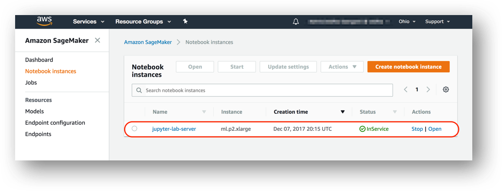
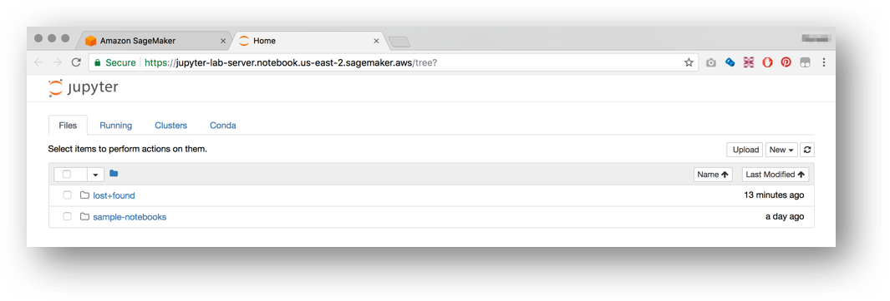

It looks like women like the service better than men, but we are not sure. Unfortunately we did not ask that information from the customer at the time of collecting the information. Is that a dead-end? Maybe not! With ML we can try to predict the gender of the person, using the information we already have. We have the name of the person, and we know that names are more or less gender specific. So, lets try to build a Machine Learning model to help us predict the gender of the person from the name. To do this, we will use the Amazon Sagemaker service.

# Amazon SageMaker 

Amazon SageMaker is a fully managed service that enables developers and data scientists to quickly and easily build, train, and deploy machine learning models at any scale. This repository contains a collection of workshops and other hands on content that will guide you through using the many features of SageMaker.  


You'll start by creating a SageMaker notebook instance with the requisite permissions. Depending on the workshop, you will then interact with SageMaker via sample Jupyter notebooks, the AWS CLI, the SageMaker console, or all three. During a workshop, you'll explore various data sets, create model training jobs using SageMaker's hosted training feature, and create endpoints to serve predictions from your models using SageMaker's hosted endpoint feature.  


# Creating a Notebook Instance

We'll start by creating an Amazon S3 bucket that will be used throughout the workshop.  We'll then create a SageMaker notebook instance, which we will use for the other workshop modules.

## 1. Create a S3 Bucket

SageMaker typically uses S3 as storage for data and model artifacts.  In this step you'll create a S3 bucket for this purpose. To begin, sign into the AWS Management Console, https://console.aws.amazon.com/.

### High-Level Instructions

Use the console or AWS CLI to create an Amazon S3 bucket. Keep in mind that your bucket's name must be globally unique across all regions and customers. We recommend using a name like `smworkshop-firstname-lastname`. If you get an error that your bucket name already exists, try adding additional numbers or characters until you find an unused name.

<details>
<summary><strong>Step-by-step instructions (expand for details)</strong></summary><p>

1. In the AWS Management Console, choose **Services** then select **S3** under Storage.

1. Choose **+Create Bucket**

1. Provide a globally unique name for your bucket such as `smworkshop-firstname-lastname`.

1. Select the Region you've chosen to use for this workshop from the dropdown.

1. Choose **Create** in the lower left of the dialog without selecting a bucket to copy settings from.

</p></details>

## 2. Launching the Notebook Instance

1. In the upper-right corner of the AWS Management Console, confirm you are in the desired AWS region. Select N. Virginia, Oregon, Ohio, or Ireland.

2. Click on Amazon SageMaker from the list of all services.  This will bring you to the Amazon SageMaker console homepage.


3. To create a new notebook instance, go to **Notebook instances**, and click the **Create notebook instance** button at the top of the browser window.


4. Type smworkshop-[First Name]-[Last Name] into the **Notebook instance name** text box, and select ml.m4.xlarge for the **Notebook instance type**.


5. For IAM role, choose **Create a new role**, and in the resulting pop-up modal, select **Specific S3 buckets** under **S3 Buckets you specify – optional**. In the text field, paste the name of the S3 bucket you created above, AND the following bucket name separated from the first by a comma:  `gdelt-open-data`.  The combined field entry should look similar to ```smworkshop-john-smith, gdelt-open-data```. Click **Create role**.


6. You will be taken back to the Create Notebook instance page.  Click **Create notebook instance**.

### 3. Accessing the Notebook Instance

1. Wait for the server status to change to **InService**. This will take several minutes, possibly up to ten but likely less.



2. Click **Open**. You will now see the Jupyter homepage for your notebook instance.



